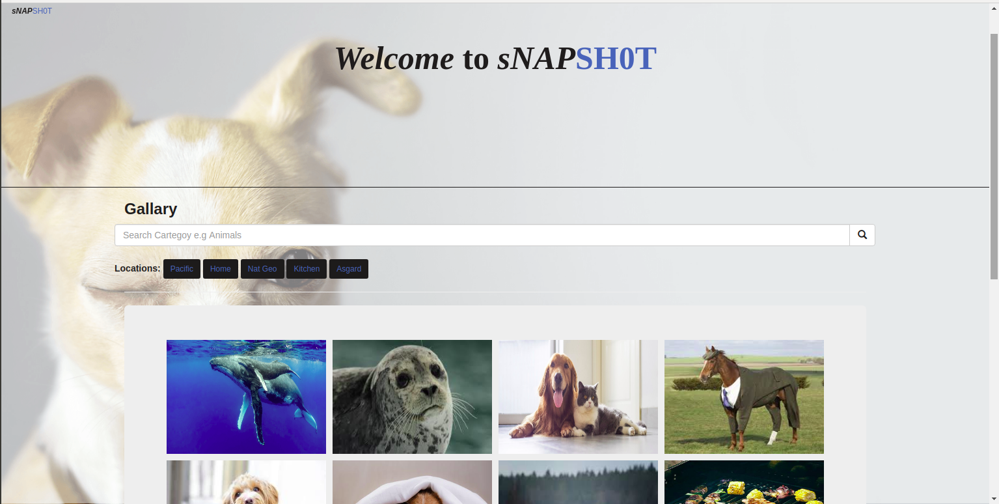

# Picstagram

## Author

[Antony Simiyu  Munyasia](https://github.com/Antony-me)

A clone of instagram that has the same functionalities of instagram

## Technologies Used

- Python

- Html

- Css 

- Shell

- SQLAkchemy

##### Requirements

Django==3.1.3

Python3.

Pip installed.

Virtualenvironment.

A text editor.

##### Setup Instructions and Installation
- Clone the repository to a directory in you computer. Link to repo https://github.com/Antony-me/Gallary
- Open terminal command line then navigate to the directory.
- Run app using python manage.py runsearver

## Interactive Input

View photos from diffrent users.

View and follow other users

Search users by name

## Development

Join me in improving this application.

To fix a bug or enhance an existing module, follow these steps:
- Fork the repo
- Create a new branch (git checkout -b improve-feature)
- Make the appropriate changes in the files
- Add changes to reflect the changes made
- Commit your changes (git commit -am 'Improve feature')
- Push to the branch (git push origin improve-feature)
- Create a Pull Request

#### Live Page https://picstagram420.herokuapp.com/
